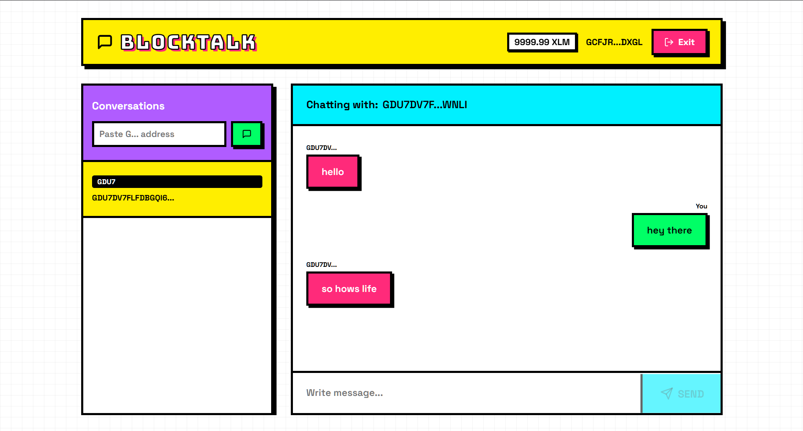
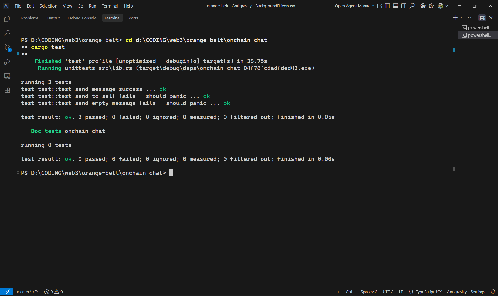

# BlockTalk - Decentralized NeoBrutalist Chat 💬

BlockTalk is a blazingly fast, end-to-end decentralized chat "mini-dApp" built entirely entirely using Soroban Smart Contract events on the Stellar blockchain. Connect your Stellar wallet, input a recipient's address, and experience an immutable conversation history.

Designed with a heavy **Neo-Brutalism** aesthetic featuring raw borders, intense shadows, and a bright unmuted color palette.



---

## 🚀 Deployed Contract

| Field | Value |
|---|---|
| **Network** | Stellar Testnet |
| **Contract ID** | `CBEDLD7IOADZNNM4JY3YN7PU3HLCOBFTMV6HIKFGMVAAXAV2KBQ2LDYB` |
| **Explorer** | [View on Stellar Expert](https://stellar.expert/explorer/testnet/contract/CBEDLD7IOADZNNM4JY3YN7PU3HLCOBFTMV6HIKFGMVAAXAV2KBQ2LDYB) |

---

## 🏆 Project Requirements & Achievements

### BlockTalk implements both Level 2 & Level 3 hackathon requirements:

1. **Minimal, Functional Mini-dApp**
   - Clean, isolated repository with a complete decentralized chat flow.
2. **Three Error Types Handled**
   - **Wallet Not Connected**: Explicit connection enforcement.
   - **Invalid Address / Self-Messaging**: Frontend rejects G-strings not hitting length/structure, and prevents messaging yourself.
   - **Transaction Rejection**: Catches Freighter/Albedo modal rejections and chain-simulation errors to gracefully broadcast UI toasts.
3. **Automated Testing Suite (3 Passing Tests)**
   - See *Testing* section below. Proves event emission and boundary conditions.
4. **Basic Caching Implementation**
   - Implemented `localStorage`-backed event caching. Initial page loads fetch instantaneous chat bubbles directly from the local browser storage while background workers seamlessly sync `server.getEvents` without RPC throttling.
5. **Loading States & Progress Indicators**
   - **Skeleton Loaders**: Custom shimmering neobrutalist skeleton bars during initial network boot loops.
   - **Action Feedback**: The *"SEND"* button physically spins up a loader (`lucide-react` Loader2) during the 3-6 second blockchain broadcast window.
6. **Multi-Wallet Integration**
   - Freighter and Albedo connection capabilities via `@creit.tech/stellar-wallets-kit@latest`.

---

## 🧪 Testing Evidence

The rust smart contract verifies three specific strict rules before emitting any message event to the blockchain, enforced by `<Address>.require_auth()`. 

- `test_send_message_success`: Checks raw Soroban variables, proving the emitted event topic/data strings perfectly match inputs.
- `test_send_empty_message_fails`: Secures against empty-string bloat spam.
- `test_send_to_self_fails`: Defends the application from logically redundant operations.

**Screenshot of Test Output Setup:**



---

## 🎥 Demo Video:


---

## 💻 Tech Stack
- **Smart Contract Core**: Rust, Soroban SDK (v22.0.0)
- **Frontend Core**: React 19, TypeScript, Vite 8, Node Polyfills via Browserify
- **Blockchain Core**: `@stellar/stellar-sdk`, `@creit.tech/stellar-wallets-kit` 
- **Aesthetic Core**: Pure Vanilla CSS, `lucide-react`

---

## Quickstart

**Deploy Contract:**
```bash
cd onchain_chat
stellar contract build
stellar contract deploy --wasm target/wasm32v1-none/release/onchain_chat.wasm --network testnet --source alice
```

**Run UI Locally:**
```bash
cd frontend
npm install --legacy-peer-deps
npm run dev
```
